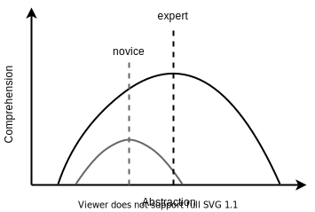

tags:: python, programming, software-design, books

- title:: [[Software Design by Example Python]]
- author:: Greg Wilson
- # Introduction
	- Made for two types of personas - those who don't know much about coding and then the teacher who wants all these topics in a book for a course:
		- 
	- ## Section 1.2 - The Big Ideas
		- ### 1. The larger a system grows, the more it grows in complexity
			- 
			- However, the number of things we can hold in working memory at any time is fixed and fairly small [[Hermans2021](https://third-bit.com/sdxpy/bib/#Hermans2021)]. If we want to build large programs that we can understand, we therefore need to construct them out of pieces that interact in a small number of ways. Figuring out what those pieces and interactions should be is the core of what we call “design”.
		- ### 2. Making sense depends on who we are
			- When using a low-level language, we incur the cognitive load of assembling micro steps into steps more meaningful
			- When using a high-level language, we incur similar load translating functions of functions into actual operations on data
			- Experts understand more but also prefer to understand at a more complex level
				- 
		- ### 3. Programs are just another kind of data