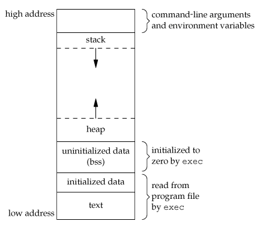

tags:: linux, virtual-machines, c-lang, hacking

- # Intro
	- Virtual memory - idealized abstraction of the storage resources that are actually available on a given machine
	- Virtual Machine
		- An operating system maps a bunch of memory addresses (virtual addresses) used by a process/program into physical addresses.
		- Main storage, as seen by a process or task, is seen as a contiguous address space or collection of contiguous segments
	- The OS manages the assignment of real memory to virtual memory space
	- Benefits include:
		- Freeing applications from having to use a shared memory  space
		- Increased security due to memory isolation
		- Conceptually being able to use more memory than is actually physically available on computer due to the technique of paging
	- ## Key Points
		- Each process has its own virtual memory
		- The amount of virtual memory depends on your system's architecture
		- Most OS virtual memory handling process looks like:
			- 
		- High memory address
			- Command line arguments and environment variables
			- The stack growing downwards
		- Lower memory addresses
			- "Executable" - a little more complicated but good enough for now
			- Heap growing upwards
				- Heap is a portion of memory that is dynamically allocated using `malloc`
	- **Virtual memory is not the same as RAM**
- # Simple C Program
	- Writing a simple c program here:
	- ```c
	  #include <stdlib.h>
	  #include <stdio.h>
	  #include <string.h>
	  
	  /**
	   * main - uses strdup to create a new string, and prints the
	   * address of the new duplcated string
	   *
	   * Return: EXIT_FAILURE if malloc failed. Otherwise EXIT_SUCCESS
	   */
	  int main(void)
	  {
	      char *s;
	  
	      s = strdup("Holberton");
	      if (s == NULL)
	      {
	          fprintf(stderr, "Can't allocate mem with malloc\n");
	          return (EXIT_FAILURE);
	      }
	      printf("%p\n", (void *)s);
	      return (EXIT_SUCCESS);
	  }
	  ```
	- ## `strdup`
		- How does `strdup` create copy of string "Holberton"?
			- It has to first reserve space since it is creating a new string - probably using `malloc`
			- We can confirm in the manual page:
				- ```
				  DESCRIPTION
				         The  strdup()  function returns a pointer to a new string which is a duplicate of the string s.
				         Memory for the new string is obtained with malloc(3), and can be freed with free(3).
				  ```
			- So will this operation be in a low or high virtual memory address? low obvious. since it needs to be dynamically allocated - let's say the heap and test our theory by compiling our program
				- ```
				  $ gcc -Wall -Wextra -pedantic -Werror main.c -o holberton
				  $ ./holberton
				  // 0x55d327a432a0
				  ```
			- We get our duplicated string address of `0x55d327a432a0` - how do we know if this is low or high virtual memory address?
- # How big is the virtual machine?
	- Depends on your computer architecture (64-bit)
		- So theoretically the size of each process' virtual memory is 2^64 bytes
			- Theoretically, the highest memory address possible is `0xffffffffffffffff` (1.8446744e+19), and the lowest is `0x0`
		- `0x55d327a43` is small compared to `0xffffffffffffffff` so it is probably a lower memory address
			- We will confirm this when we look at the `proc` file system
- # The proc filesystem
	- ```
	  The proc filesystem is a pseudo-filesystem which provides an interface to kernel data structures.  It is commonly mounted at `/proc`.  Most of it is read-only, but some files allow kernel variables to be changed.
	  ```
	- If you list the contents of the `/proc` directory, there will be a lot of files. We'll focus on:
		- `/proc/[pid]/mem`
		- `/proc/[pid]/maps`
- # mem
	- ```
	  /proc/[pid]/mem
	                This file can be used to access the pages of a process's memory
	            through open(2), read(2), and lseek(2).
	  ```
		- Can we access and modify the entire virtual memory of any process?
- # maps
-