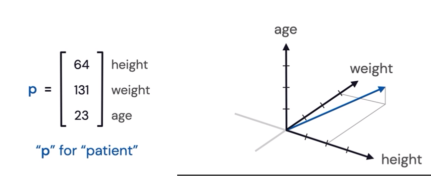
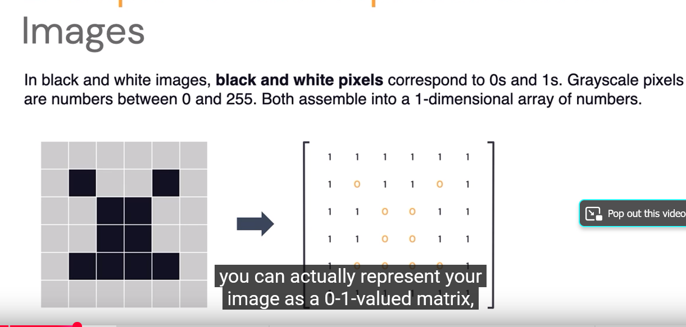

tags:: linear-algebra, ml-math, tensorflow

- category:: [[Linear Algebra]]
- title:: Tensorflow Linear Algebra Video Notes
- # TOC
	- # Introduction
		- ### Data Representations
			- How can we represent data in a way that computers can understand?
				- Organize info into a vector
					- One dimensional array of numbers that has magnitude and direction
					- Totality of vectors with n-entries is an n-dimensional vector space
						- 3 Dimensional space is a vector with three entries
					- #### In ML
						- Feature vector is a vector that represents features of an object
							- 
					- ## Examples
						- 
						-
		- ### Vector Embeddings
		- ### Dimensionality Reduction
		-